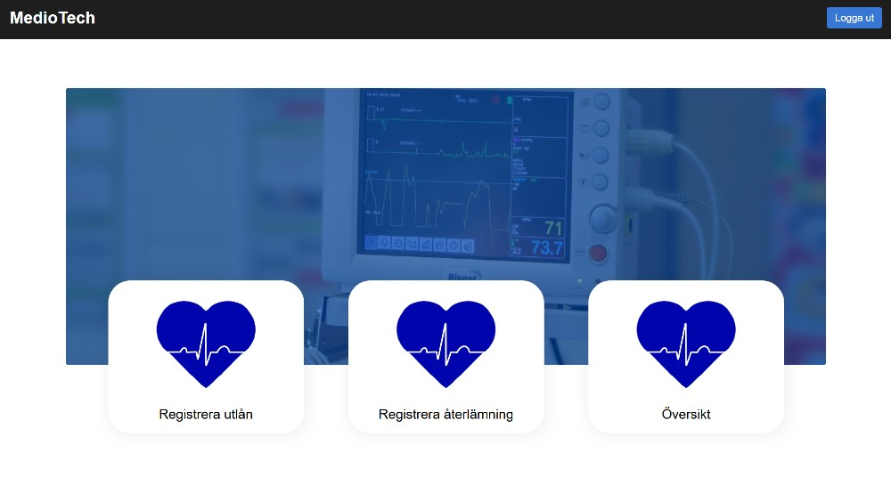
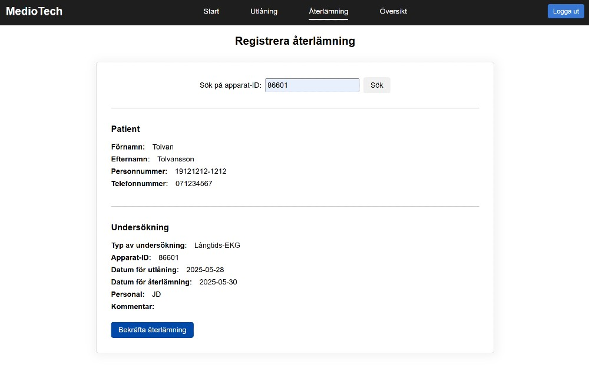
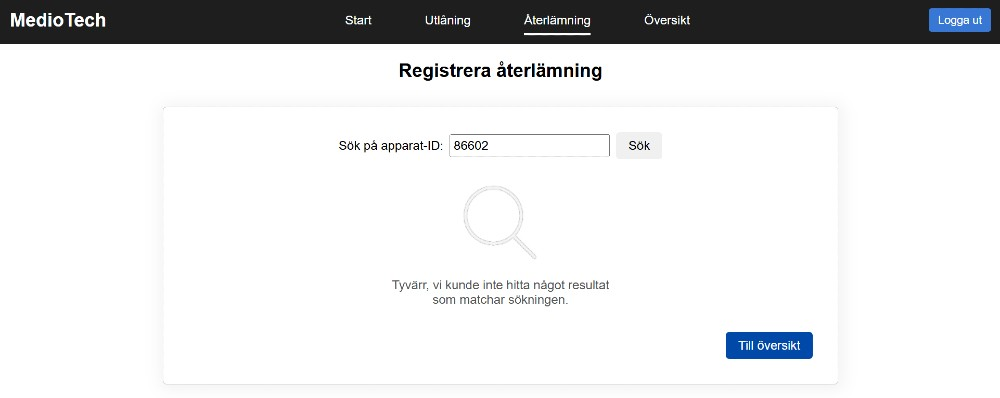
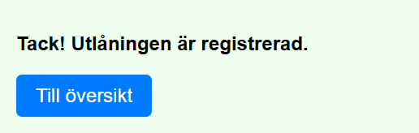

# MedioTech

## Name
MedioTech

## Description
This was a student project developed as part of the course 1DV613 - Software Project (15 ECTS), within the Web Development program at Linnaeus University (Sweden). The system was intended for clinical use cases in Swedish healthcare. The project is no longer maintained.

Tech stack used:
* HTML/CSS
* JavaScript
* Firebase Hosting
* Firebase Authentication
* Firestore

En mer detaljerad README på svenska finns här: [README.sv.md](README.sv.md)

## Project 
This project was carried out using agile methods. We worked in weekly iterations and as part of the project process, we produced:

* A project vision
* A risk assessment
* A requirements specification
* A product backlog
* Manual test cases and automated tests (using Jest)
* A CI/CD pipeline for deployment (via Firebase Hosting)

The goal was not only to build a functioning system, but also to practice working as a development team in a realistic and professional workflow.

## Visuals
The following screenshots show different parts of the system.

### Login page

### Dashboard

### Loan page

### Overview page

### Return page
 

### Error and confirmation messages
 

## Installation
The system is no longer deployed.

## About the author
This project was developed by Sofia Nord, student in the Web Development program at Linnaeus University. You can find more of my work at [GitHub](https://github.com/sofia-mnord/).

## License
 This code is shared for portfolio purposes under the CC BY-NC-ND 4.0 License. You may view the code, but you may not use, modify, or redistribute it.

