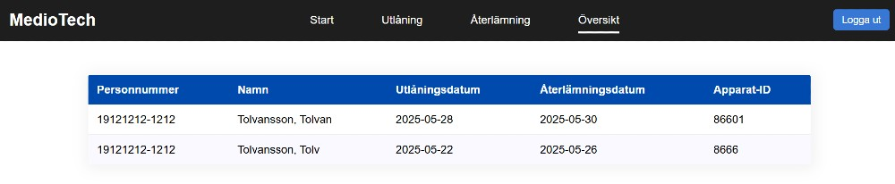

# MedioTech

## Namn
MedioTech

## Beskrivning
Detta var ett studentprojekt som genomfördes inom kursen 1DV613 – Mjukvaruprojekt (15 hp) på programmet Webbprogrammering vid Linnéuniversitetet. Kursen erbjuds under första året på utbildningen.

På många kliniker och mottagningar inom hälso- och sjukvården genomförs undersökningar i hemmet, exempelvis sömnapnéutredning eller långtids-EKG. Syftet med detta projekt var att utveckla ett digitalt system för utlåning av medicinteknisk utrustning, liknande hur utlåning av böcker och media fungerar på bibliotek. Tanken var att systemet skulle skapa en mer strukturerad process för vårdpersonal, som slipper använda papper och penna för detta.

Funktioner i systemet:
- Inloggning med användarkonto
- Registrera ett nytt lån
- Se översikt av pågående lån
- Återlämna utrustning

Teknikstack som användes:
* HTML/CSS
* JavaScript
* Firebase Hosting
* Firebase Authentication
* Firestore

## Project 
Projektet genomfördes med hjälp av agila metoder. Vi arbetade i veckovisa iterationer, och i processen producerades:

* En projektvision
* En risklista
* En kravspecifikation innehållandes användarscenarier
* En produktbacklogg
* Manuella testfall och automatiserade tester (genom användande av Jest)
* En CI/CD pipeline för driftsättning (via Firebase Hosting)

Målet var inte bara att bygga ett funktionellt system, utan också att testa på att arbeta som ett utvecklingsteam i ett realistiskt och professionellt arbetsflöde.

## Visuals
Följande skärmdumpar visar olika delar av systemet.

### Inloggning

### Dashboard

### Utlåning av utrustning

### Översikt

### Återlämning av utrustning
 

### Felmeddelande och bekräftelse
 

## Installation
Systemet är inte längre driftsatt.

## Om författaren
Detta projekt utvecklades av Sofia Nord, student på Webbprogrammerar-programmet på Linnéuniversitetet. Du kan hitta mer av mina projekt på [GitHub](https://github.com/sofia-mnord/).

## Licens
Denna kod delas i portfoliosyfte under licensen CC BY-NC-ND 4.0. Du får titta på koden, men den får inte användas, modifieras eller spridas vidare.
